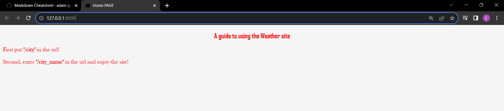
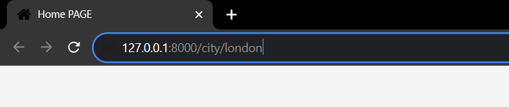
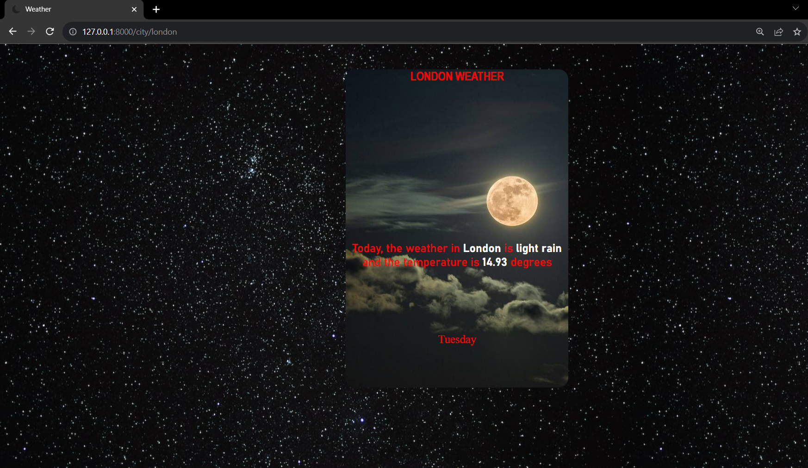

#WEATHER APP

**This program can provide you with the weather of different countries.**

###Application guide:
**You enter the program through the link [Weather app](http://127.0.0.1:8000/) and the site will look like this**

**After entering the program, you first enter "/city" in the url as shown in this picture**

**After that you put the "/" character and enter the name of the city or country you want. For example**

**And if you press the "ENTER" button, this window will open**

I hope you have benefited from the program